<div align="center">

<a href="https://github.com/ARJYUN">
  <picture>
    <source media="(prefers-color-scheme: dark)" srcset="dark.svg">
    <source media="(prefers-color-scheme: light)" srcset="light.svg">
    
  </picture>
</a>

<br>

<a href="https://github.com/ARJYUN">
  
</a>

</div>

---

### 💻 `arjun@mainframe:~$ whoami --verbose`
```json
{
  "user": "Arjun K",
  "base": "Kerala, India 🇮🇳",
  "role": ["Frontend Engineer", "Full Stack Developer", "AI Enthusiast"],
  "status": "Building performant web applications...",
  "contact": {
    "email": "arjunk.karjun.arjunk@gmail.com",
    "portfolio": "https://arjunk.vercel.app"
  }
}
```

---

### 📂 `arjun@mainframe:~$ ls -la /usr/bin/skills`

<div align="center">

<details open>
<summary><code>drwxr-xr-x 1 arjun root 4096 May 04 12:00 skills/</code> (click to collapse)</summary>
<br>

| `drwxr-xr-x` Languages | `drwxr-xr-x` Web & Mobile | `drwxr-xr-x` Tools & OS |
|:---:|:---:|:---:|
|  <br>  <br>  <br>  <br>  |  <br>  <br>  <br>  <br>  |  <br>  <br>  <br>  |

</details>

</div>

---

### 📊 `arjun@mainframe:~$ htop -u arjun -p skills_progress`
```text
  PID USER      PRI  NI  VIRT   RES   SHR S CPU% MEM%   TIME+  COMMAND
 1337 arjun      20   0  2048M 1024M  512 R 99.9 45.2  23:42.1 node ./next-app       [■■■■■■■■░░] 80%
 2048 arjun      20   0  4096M 3048M 1024 S 45.3 65.4  12:14.3 react-scripts        [■■■■■■■■■░] 90%
  101 arjun      10 -10   256M   64M   32 S 10.5 10.2 145:10.5 python3 ai-model.py  [■■■■■■■░░░] 70%
  404 arjun      20   0  1024M  512M  128 S 25.1 20.1  45:12.7 docker compose up    [■■■■■■■■░░] 80%
   80 arjun      20   0   512M  256M   64 S 15.0 15.0  80:44.2 figma render-ui      [■■■■■■■■■░] 90%
  200 arjun      20   0   256M  128M   32 S 20.4 12.1  50:22.1 tailwind-compiler    [■■■■■■■■■■] 100%
```

---

### 📡 `arjun@mainframe:~$ ping -c 5 network.socials`
<div align="center">

<a href="https://arjunk.vercel.app"></a>
<a href="https://github.com/ARJYUN"></a>
<a href="https://linkedin.com/in/arjun-k-ba7a99311"></a>
<a href="mailto:arjunk.karjun.arjunk@gmail.com"></a>

</div>

---

### 📈 `arjun@mainframe:~$ curl -X GET https://api.github.com/users/arjyun/stats`
<div align="center">

<a href="https://github.com/ARJYUN">
  <!-- Replaced bright green with #22D3EE (Cyan) to match the new banner's premium aesthetic -->
  
</a>
<a href="https://github.com/ARJYUN">
  
</a>

</div>

---

### 📉 `arjun@mainframe:~$ ./render_activity_graph.sh`
<div align="center">

<a href="https://github.com/ARJYUN">
  
</a>

</div>

---

### 🏆 `arjun@mainframe:~$ ./fetch_trophies.sh`
<div align="center">

<a href="https://github.com/ARJYUN">
  
</a>

</div>

---

<div align="center">

```bash
root@mainframe:~# tail -n 5 /var/log/syslog
[WARN] Kernel module 'sleep' has crashed. Too much coffee detected.
[INFO] Attempting hot-reload of 'brain.ko'... Success.
[INFO] Compiling new ideas into reality...
[WARN] Caution: High levels of creativity might cause unexpected behavior.

root@mainframe:~# cat /etc/motd
╔══════════════════════════════════════════════════════╗
║   "First, solve the problem. Then, write the code."  ║
║                                       — John Johnson  ║
╚══════════════════════════════════════════════════════╝

root@mainframe:~# logout
Connection to mainframe closed.
```

*← System offline. Made with 🩵 and 0 warnings →*

</div>
